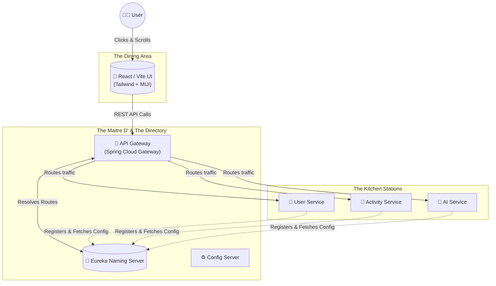

# 🥗 FitCalorie Platform
> **[▶️ Watch the End-to-End System Demo Video Here (Link Placeholder) ](https://your-video-link-here.com)**
> *Note: Click the link above to watch a detailed visual breakdown of the application in action.*

Welcome to the **FitCalorie Microservices Platform**, an enterprise-grade fitness and health-tracking ecosystem. This repository is not just a collection of code—it’s a carefully structured orchestration of services designed to seamlessly manage user activity, profile data, and AI-driven health evaluations. 

This documentation is built differently. Whether you're a product manager exploring business value or a senior backend architect analyzing our data flow, you're in exactly the right place.

---

## 1. The "50,000-Foot" View 🚁

### 🎯 The Goal
The purpose of FitCalorie is to provide users with a robust, scalable, and intelligent platform for tracking physical activities and monitoring nutritional metrics. It solves the fragmentation of health-tracking apps by unifying activity logging, user profiling, and AI analysis under one scalable microservices umbrella.

### 🍽️ The Restaurant Analogy (How it all works)
Imagine FitCalorie as a high-end, extremely efficient restaurant.
* **The Frontend (React App)**: The *Dining Area* where the user is seated. It's beautiful, responsive, and handles all customer interactions smoothly.
* **The API Gateway**: The *Maitre D'*. The customer only ever speaks to the Maitre D', who securely takes the request and routes it to exactly the right kitchen station.
* **Eureka (Service Registry)**: The *Staff Directory*. It knows exactly which kitchen staff (microservices) are currently on duty and where they are located.
* **The Microservices (User, Activity, AI)**: The *Kitchen Stations*. Each station handles one specific thing—tracking your run, updating your profile, or generating AI dietary insights.

### 🗺️ System Architecture
Before reading a single line of code, let's visualize how the platform communicates.

---

## 2. Choose Your Path: Tailored Guides 🛤️

### 📊 For Non-Technical & Management Teams
**The Business Value**: FitCalorie uses a microservices architecture, which means if the *Activity Service* goes down due to heavy weekend gym traffic, the *AI Service* and *User Profiles* remain entirely unaffected. This guarantees maximum uptime. 
* **Key Features**: Secure OAuth2 logins, AI-driven diet evaluations, and a highly responsive single-page application (SPA).
* **The User Scenario**: A user logs their morning 5K run. They view their personalized dashboard, and the AI suggests a tailored calorie replenishment meal. That's three different services working together seamlessly in less than 200 milliseconds.

### 💻 For Developers & Technical Peers
**The Architecture**: We employ a Spring Boot distributed system orchestrated by Eureka.
* **Frontend**: React 19, Redux Toolkit for state management, Vite for HMR, styled with Tailwind CSS and Material UI.
* **Backend**: Spring Cloud ecosystem. Configs are externalized via ConfigServer. API Gateway handles cross-cutting concerns (CORS, centralized routing). 
* **Design Pattern**: Domain-Driven Design (DDD). We've decoupled the `UserService` from the `ActivityService` to prevent tightly coupled monolithic behaviors.

---

## 3. The Code Walkthrough 🔎

Let’s trace the flow of our application. We won't jump from file to file blindly—we'll follow a real action. 

### 🟢 Start at the Entry Point
* **Frontend**: Execution begins in `/FrontEnd Part/src/main.jsx`. Here, the React tree is wrapped in the Redux `Provider` and our routing matrix. 
* **Backend**: All external traffic hits `gateway/src/main/java/.../GatewayApplication.java`. It acts as the singular reverse proxy.

### 🔗 The "Chain of Actions": Logging a Workout
*What exactly happens when a user clicks "Log Workout"?*
1. **The Click**: User triggers the UI form. Redux Toolkit initiates an async thunk via Axios (`FrontEnd Part/src/.../api.js`).
2. **The Routing**: The HTTP POST hits `http://localhost:8080/activities`.
3. **The Proxy**: Spring Cloud Gateway intercepts the request. It queries Eureka: *"Where is the Activity Service?"*
4. **The Execution**: The `ActivityController` receives the DTO. It maps it to the `Activity` Entity, saves it to the database, and returns a 201 Created response.
5. **The State Update**: The React frontend resolves the Axios promise and dispatches a Redux payload to instantly update the UI chart without a page refresh.

### 📐 Key Data Models
* `User Entity`: The core identity. (Handled exclusively by `UserService`)
* `Activity Entity`: Tied to a User ID. Contains contextual metadata (calories, duration, metric type).

---

## 4. Interactive and Visual Exploration 🧪

Reading code is good; running code is better. 

### 🪲 Live Debugging & Demos
Instead of reading the backend classes statically, run the application in **Debug Mode**:
1. Open IntelliJ IDEA or Eclipse.
2. Put a **Breakpoint** inside `ActivityService / ActivityController.java` on the `@PostMapping`.
3. Fill out the form in the React frontend and hit submit.
4. Watch the IDE pause execution! Hover your mouse over the incoming request variables to see the data transform in real-time. This is the fastest way to understand the data contracts.

### 💡 Utilize IDE Features effectively
Don't scroll manually. Rely on your IDE:
* **"Go to Definition" (Ctrl/Cmd + Click)**: Use this on frontend API hooks to jump straight to the Axios implementation.
* **"Find All References"**: Use this on backend DTOs to see exactly which controllers and services are consuming that specific data schema.

---

## 5. Essential Setup & Philosophy Guide ⚙️

### 📚 "Why" Comments Philosophy
As you browse the codebase, you'll see comments. We enforce "Why" over "What".
* *Bad:* `// Maps data to object` (Tells you what it does, which is obvious).
* *Good:* `// Mapping manually here rather than using MapStruct to maintain fine-grained control over date-format casting for older SQL dialects.`

> **Tip - The Commit History**: Curious why a specific architectural choice was made a year ago? Use `git blame <file>` in your terminal or right-click the gutter in your IDE to see who wrote the line and their pull request context.

---

### 🚀 End-to-End Installation (The Non-Technical Guide)
If you just want to run this application locally and see it work, follow these simple steps:

**Step 1: Get the Tools**
* Download and install **Java 17+** (The engine for the backend).
* Download and install **Node.js** (The engine for the frontend).

**Step 2: Start the Backend (The Kitchen)**
Open your terminal (Command Prompt/Terminal), navigate to the `BackEnd-Part` folder, and start the core microservices in this specific order using Maven (`./mvnw spring-boot:run`):
1. `eureka` (Start the directory first)
2. `configserver` (Start the configuration next)
3. `gateway` (Start the Maitre D' next)
4. Finally, start the `userservice`, `activityservice`, and `aiservice`.

**Step 3: Start the Frontend (The Dining Area)**
Open a *new* terminal window, navigate to the `FrontEnd Part` directory, and type:
1. `npm install` (This downloads all the paint and decorations for the website).
2. `npm run dev` (This turns the website on).
3. Open your browser and go to the link it provides (usually `http://localhost:5173`). You are now running the full enterprise suite!

---

### 📄 License

**MIT License**

Copyright (c) 2026 FitCalorie

Permission is hereby granted, free of charge, to any person obtaining a copy of this software and associated documentation files (the "Software"), to deal in the Software without restriction, including without limitation the rights to use, copy, modify, merge, publish, distribute, sublicense, and/or sell copies of the Software... 

*(For the full legal context, see the LICENSE file in the repository).*
